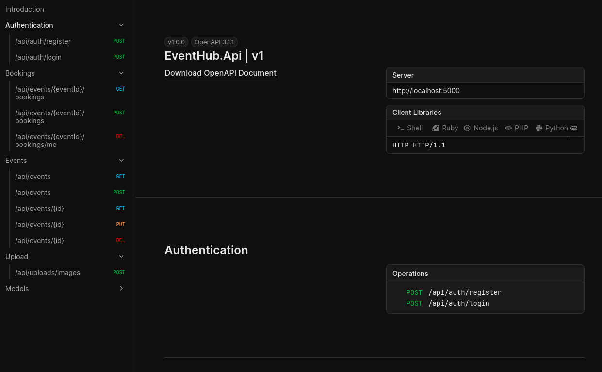
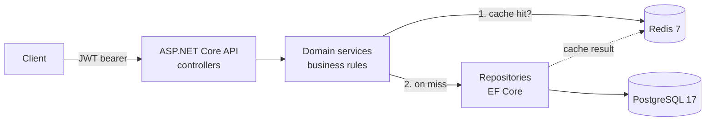
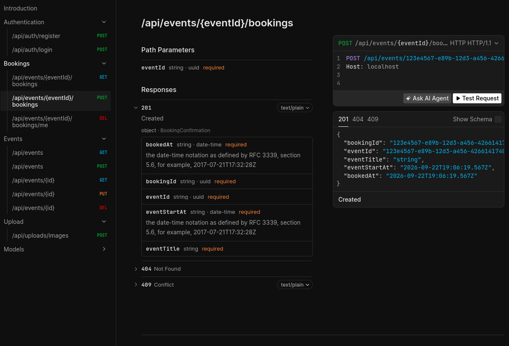
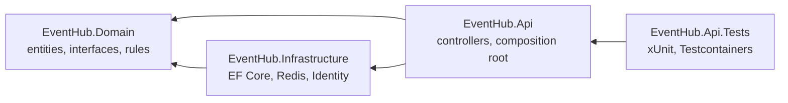

# EventHub

Backend for an event/meetup platform. Users create events, sign up for them with a
limited number of seats, and search and filter events.

A learning project for backend architecture: layering, dependency injection, the
repository pattern, auth, concurrency, caching.



## Tech stack

| Area               | Choice                 |
|--------------------|------------------------|
| Language/framework | C#, ASP.NET Core       |
| Database           | PostgreSQL 17          |
| ORM                | Entity Framework Core  |
| Cache              | Redis 7                |
| Auth               | JWT + ASP.NET Identity |
| Tests              | xUnit + Testcontainers |



## Prerequisites

- .NET SDK (see `global.json` or `TargetFramework` in the `.csproj` files)
- Docker – required for the tests too, not just for local development
- `dotnet-ef` as a global tool:

```bash
dotnet tool install --global dotnet-ef
```

On Linux the tool lands in `~/.dotnet/tools`, which is not on the PATH by default:

```bash
export PATH="$PATH:$HOME/.dotnet/tools"
```

## Setup

### 1. Start the containers

```bash
docker run -d --name eventhub-db \
    -e POSTGRES_PASSWORD=dev \
    -e POSTGRES_DB=eventhub \
    -p 5432:5432 \
    postgres:17

docker run -d --name eventhub-redis \
    -p 6379:6379 \
    redis:7-alpine
```

After that, this is enough:

```bash
docker start eventhub-db eventhub-redis
```

### 2. Set the user secrets

Credentials and the JWT key do not belong in the repository. They live in user secrets,
which are only read in `Development`.

```bash
cd src/EventHub.Api

dotnet user-secrets set "ConnectionStrings:Default" \
    "Host=localhost;Port=5432;Database=eventhub;Username=postgres;Password=dev"
dotnet user-secrets set "Jwt:Key" "$(openssl rand -base64 48)"

dotnet user-secrets list
```

Both keys are required; the app throws on startup if either is missing. Everything else
lives in `appsettings.json`, because none of it is secret: `ConnectionStrings:Redis` plus
`Jwt:Issuer`, `Jwt:Audience` and `Jwt:ExpiryMinutes`.

`ConnectionStrings:Default` stays in `appsettings.json` as an empty entry so the
repository still documents which keys the app expects.

### 3. Set up the database

```bash
dotnet ef database update --project src/EventHub.Infrastructure --startup-project src/EventHub.Api
```

### 4. Run

```bash
cd src/EventHub.Api && dotnet run
```

The API listens on `http://localhost:5000`, the API documentation is at
`http://localhost:5000/scalar`.

Port and environment come from `Properties/launchSettings.json`. Without that file
`dotnet run` starts in `Production`, user secrets are never read, and every request fails
on a missing `Jwt:Key`.

## Migrations

Run all commands from the repository root. The migrations live in
`EventHub.Infrastructure`, the configuration in the startup project `EventHub.Api` –
hence both arguments every time.

```bash
# Add a migration
dotnet ef migrations add <Name> --project src/EventHub.Infrastructure --startup-project src/EventHub.Api

# Apply
dotnet ef database update --project src/EventHub.Infrastructure --startup-project src/EventHub.Api

# Remove the last migration, as long as it has not been applied
dotnet ef migrations remove --project src/EventHub.Infrastructure --startup-project src/EventHub.Api

# Inspect the generated SQL without running it
dotnet ef migrations script --project src/EventHub.Infrastructure --startup-project src/EventHub.Api
```

**Rule:** applied migrations are never edited, only superseded by new ones. Before
applying, read the generated file – indexes, nullability and delete behaviour reveal how
EF understood the fluent API chain.

## Tests

```bash
dotnet test
```

Docker has to be running. The tests spin up their own Postgres and Redis containers via
Testcontainers on random ports, apply the real migrations and seed users and categories.
No setup required, and the local development database is left untouched.

The images deliberately match the ones used for local development. Testing against a
different Postgres major version than you run is an avoidable risk.

The tests' JWT key sits in the test code in plain text. That is correct here: it signs
nothing that ever leaves a test process.

## Endpoints



| Method   | Path                           | Access                |
|----------|--------------------------------|-----------------------|
| `POST`   | `/api/auth/register`           | anonymous             |
| `POST`   | `/api/auth/login`              | anonymous             |
| `GET`    | `/api/events`                  | anonymous             |
| `GET`    | `/api/events/{id}`             | anonymous             |
| `POST`   | `/api/events`                  | Organizer             |
| `PUT`    | `/api/events/{id}`             | the event's organizer |
| `DELETE` | `/api/events/{id}`             | the event's organizer |
| `POST`   | `/api/uploads/images`          | the events organizer  |
| `POST`   | `/api/events/{id}/bookings`    | authenticated         |
| `DELETE` | `/api/events/{id}/bookings/me` | authenticated         |
| `GET`    | `/api/events/{id}/bookings`    | the event's organizer |

`GET /api/events` takes optional query parameters:
`?categoryId=1&location=kassel&from=2026-10-01T00:00:00Z&to=2026-10-31T00:00:00Z`

### Example

```bash
TOKEN=$(curl -s -X POST http://localhost:5000/api/auth/login \
    -H 'Content-Type: application/json' \
    -d '{"email":"organizer@test.com","password":"Test1234!"}' | jq -r .accessToken)

curl -s http://localhost:5000/api/events | jq
curl -s -X POST http://localhost:5000/api/events/<eventId>/bookings \
    -H "Authorization: Bearer $TOKEN"
```

## Benchmark

`scripts/bench.sh` measures `GET /api/events` over N calls.

```bash
./scripts/bench.sh http://localhost:5000/api/events 100
```

Needs `bc` and `jq`. The first call after startup measures the startup, not the query –
JIT, connection setup and building the EF model cost seconds there. Median and p95 after
a warm-up run are the numbers that mean something.

Measured with roughly 500 events, locally, requests one after another:

|        | without cache | with Redis |
|--------|---------------|------------|
| Median | 10.1 ms       | 3.8 ms     |
| p95    | 20.2 ms       | 5.2 ms     |
| Max    | 25.6 ms       | 6.9 ms     |

The median drops by a factor of three, the p95 by a factor of four. So response times do
not just get faster, they get steadier – Redis hands back a ready-made string from
memory, while Postgres plans and reads afresh for every request.

## Project structure

```
EventHub/
├── EventHub.sln
├── scripts/
│   └── bench.sh
├── src/
│   ├── EventHub.Domain/          → references nothing
│   ├── EventHub.Infrastructure/  → Domain
│   └── EventHub.Api/             → Domain + Infrastructure
└── tests/
    └── EventHub.Api.Tests/       → Api (Domain/Infrastructure transitively)
```



**Dependencies point inwards, never outwards.** Domain holds the entities, interfaces,
read models and the services carrying the business rules. Infrastructure supplies the
implementations that need third-party technology (EF Core, Redis, Identity). Api consists
of controllers, input models and the composition root in `Program.cs`.

Why separate projects rather than plain folders: the compiler enforces the split. A
`using Microsoft.EntityFrameworkCore;` inside Domain simply fails to build.

## Configuration

The key stays the same, the source changes. Later sources override earlier ones:

1. `appsettings.json`
2. `appsettings.{Environment}.json`
3. User secrets (Development only)
4. Environment variables (`ConnectionStrings__Default`, double underscore)
5. Command-line arguments

Driven by `ASPNETCORE_ENVIRONMENT`. No `if` in the code, no separate keys for dev and
prod.